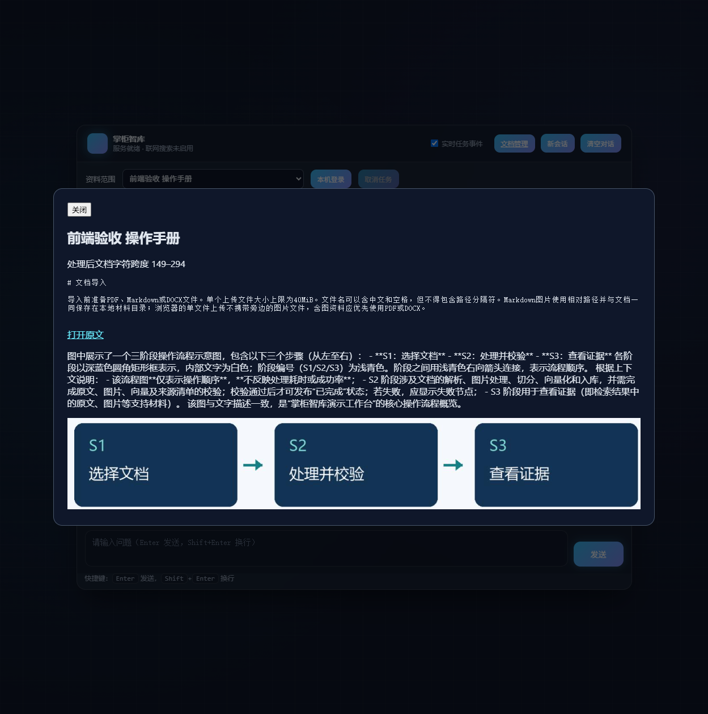

# 掌柜智库 · 可追溯的多模态文档问答

PDF、DOCX、Markdown 导入后，经过真实文档解析、图片理解、对象存储、向量检索和模型生成，返回可打开原文的引用。保留课程 API / Service / Processor / Utils 分层与两条 LangGraph 工作流，在已有工程和数据库旁增加独立版本空间。

**当前交付是本地实际运行的应用。** 文本模型为百炼业务空间的 `qwen-plus`，视觉模型为 `qwen3-vl-plus`；用户指定的 `qwen3-plus` 在当前空间实际返回 `404 model_not_found`，因此没有把它记为成功。模型 Key 只存在本机私有配置。PDF 解析使用 **MinerU 2.7.1**，DOCX 使用 python-docx 适配器。



## 已实测的闭环

|输入|实际处理|导入 / 查询耗时|结果|
|---|---|---|---|
|原创 Markdown 图文手册|10 片段、1 图片、VLM、MinIO、Milvus|21.438 / 6.641 秒|带 40 MiB 原文引用|
|原创两页 PDF|MinerU、11 片段、1 图片|55.375 / 6.656 秒|原文件、图片与片段均可读回|
|原创 DOCX 图文表格手册|11 片段、1 图片、真实表格|18.917 / 7.974 秒|正确解释 PDF / DOCX 用途|
|用户本机教育 DOCX|18 片段，保留旧版本|17.890 / 12.016 秒|真实 Python 习题检索与引用|

上表是单次墙钟时间，不能代表 SLA。60 题首轮实际调用完成 **59/60**；冻结集 **20/20**。热查询 P50 **6.922 秒**，P95 **9.220 秒**。一次模型引文两次校验均失败，系统拒绝发布答案。评测采用代理编写、原文锚定的小型题集，不能称为人工独立标注准确率。完整口径见 [验证报告](docs/VERIFICATION.md) 与 [评测方法](docs/EVALUATION.md)。

## 运行

在已经核验的本机工程根目录执行：

```powershell
& scripts/start-local.ps1
```

打开 `http://127.0.0.1:8000/front/chat.html`，使用本机 **APP_API_TOKEN** 登录。浏览器不接收模型 Key。原数据库和容器继续使用；本应用在独立 namespace 中写入。

首次配置、解释器、缓存与服务地址见 [Windows 启动指南](docs/GETTING_STARTED_WINDOWS.md)。这不是免配置的一键云部署；外部机器必须具备自己的服务、模型缓存与凭据。没有公网在线 Demo。

## 关键工程能力

- 上传签名、大小和路径检查；DOCX ZIP 展开大小限制；图片内容哈希与 MinIO SHA256 读回。
- 相同文档版本复用；版本由源内容和处理配置共同决定。Mongo active pointer 在对象和向量核验后更新，旧版本保留。
- BGE-M3 1024 维 dense + learned sparse 混合检索；HyDE 仅用于召回，RRF 排名融合，BGE-reranker-large 512 token 重排。
- 检索限定 owner、document、version；答案引用只能来自当次 evidence，连续引文逐字校验。
- SQLite WAL 持久任务、SSE 序号重放、取消、超时、失败状态；Mongo 原子保存完整会话轮次。
- 同源 FastAPI 前端，真实任务进度、历史恢复、文档选择、歧义澄清和来源弹窗。

## 阅读入口

|目标|入口|
|---|---|
|理解系统|[架构](docs/ARCHITECTURE.md)、[工作流](docs/WORKFLOWS.md)|
|阅读真实源码|[源码指南](docs/CODE_GUIDE.md)、[19 章映射](docs/SOURCE_MAP.md)|
|接入与维护|[API](docs/API.md)、[模型配置](docs/MODEL_CONFIGURATION.md)、[部署与运维](docs/DEPLOYMENT.md)|
|核对结果|[验证报告](docs/VERIFICATION.md)、[已知限制](docs/KNOWN_ISSUES.md)、[变更审查](docs/DIFF_REVIEW.md)|
|面试演示|[3 / 8 分钟脚本](docs/DEMO.md)、[技术问答](docs/INTERVIEW.md)|
|发布审查|[权限与来源](docs/PUBLICATION.md)、[第三方组件](THIRD_PARTY_NOTICES.md)、[安全说明](SECURITY.md)|

## 测试

```powershell
# 单元 / 合同测试：包含替身，不冒充真实服务验收
.venv_app/Scripts/python.exe -m pytest tests -q
# 以下连接真实数据库或产生真实模型调用费用
.venv_app/Scripts/python.exe scripts/doctor.py
.venv_app/Scripts/python.exe scripts/verify_http.py
.venv_app/Scripts/python.exe scripts/evaluate.py --dataset examples/public/evaluation20.json --output artifacts/verification/baseline/evaluation-new
```

评测前导入对应手册，详见评测指南。完整运行依赖 GPU、本机 MinerU 缓存、VM 中的 MinIO / MongoDB / Milvus 和有效百炼业务空间认证；公开 CI 只执行离线合同检查。

## 来源与公开范围

该工程包含用户提供的课程衍生实现。尚未发现允许整套课程源码公开分发的许可，**不对全仓库擅自声明 MIT 许可**。原创样例手册使用独立 CC0 声明；课程原件、私人教育数据、模型权重、环境、Key、数据库导出及原始运行日志不进交付 Git。

公开发布需先确认课程衍生部分的权利和可见范围。目前源码可在本地完整查看；发布状态见 [权限清单](docs/PUBLICATION.md)。
