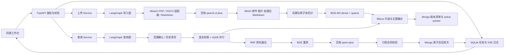

# 系统架构

## 分层与数据边界

`api/` 负责访问凭证、HTTP 与上传边界；`service/` 负责任务生命周期和会话锁；`processor/` 保留节点 `process(state)` 合同；`utils/` 负责对象、向量、文档版本、模型与历史。

所有 LLM/VLM 客户端从同一配置入口获得 Key 与业务空间 Base URL。`MODEL_CONFIG_SOURCE=file` 明确以指定配置文件为准，清理旧模型环境变量的覆盖。StorageClients 只处理存储依赖，不夹带另一套模型认证。

## 三种存储各自保存什么

|存储|职责|一致性边界|
|---|---|---|
|MinIO|不可变原件、图片、处理后 Markdown|写后读取并比较 SHA256；私有 bucket，经鉴权 API 访问|
|Milvus|片段与主题的 dense / sparse 向量、定位信息|稳定主键 upsert，flush 后按主键确认；查询 Strong 一致性|
|MongoDB|版本 manifest、活动版本指针、整轮会话|单文档原子写入；不宣称跨库事务|
|SQLite WAL|任务、节点耗时、SSE 事件序号|持久重放，最终状态只发布一次；当前约束为单应用 worker|

先完成对象与向量核验，最后发布活动版本。失败可能留下尚未发布的对象或向量，任务日志记录对应前缀。当前没有自动垃圾回收；不会为了“清理”而删除旧业务数据。

## 模型与计算

BGE-M3 产生 1024 维 dense 与学习得到的 token 稀疏权重，**不是 BM25**。dense 使用 COSINE，sparse 使用 IP，混合加权后对本地与 HyDE 两路执行 RRF。Reranker 使用 query-document pair，输入最多 512 token。GPU 进程内锁避免本应用同时加载/运行大型阶段，但不同独立 CLI 进程没有跨进程 GPU 调度。

HyDE 的假设文本不能成为引文。生成答案时仅给出经过版本和 owner 过滤的真实片段，限制总上下文字符数。先完成结构和连续引文校验，再保存历史与推送答案事件。当前 SSE 是**节点事件 + 完整已校验答案**，不是逐 token 流。

## 当前部署边界

Windows 单进程 API + GPU 模型；Linux VM 复用已有 Docker 存储服务。未验证高并发、多 worker、集群故障迁移或公网 TLS。联网 MCP 搜索接口保留但默认关闭，没有凭据时不会把它显示为成功。产品为检索增强问答，不包含未经实现的知识图谱推理。
