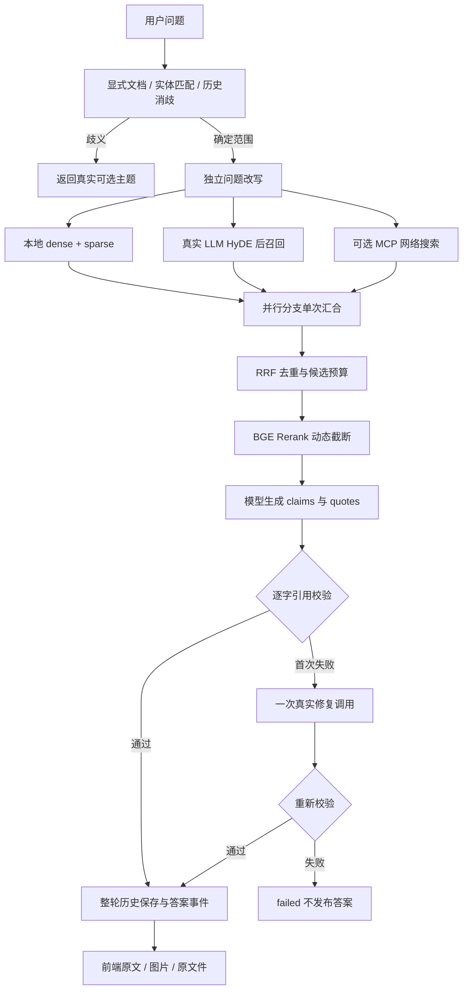

# 导入与查询工作流

## 导入

1. `POST /upload` 验证扩展名、文件名、40 MiB 大小上限，落到独立任务目录，返回 task_id。
2. EntryNode 校验 PDF / ZIP 签名或 UTF-8 Markdown，计算 owner + source label 文档身份，以及源内容、图片和处理配置版本哈希。
3. 已有同一 committed 版本时复用；否则 PDF 启动真实 MinerU 子进程，DOCX 按 Word 段落、标题、图片和表格顺序生成 Markdown。
4. 图片节点读取真实图片及相邻文字，调用 `qwen3-vl-plus`，记录摘要与调用元数据，写 MinIO 并 SHA256 读回。原 Markdown 不被覆盖。
5. 切分保留标题路径和 processed Markdown 字符范围；表格、代码块、图片引用为原子块。单块过大明确失败，不静默截断。
6. 文本模型识别主题 / 实体；BGE-M3 对片段和主题生成真实向量。Milvus 校验维度与记录数量。
7. 发布 Mongo 版本 manifest，最后更新 active pointer，任务方可 completed。

PDF 与 DOCX 实测均含图片。DOCX 表格测试验证了文字及行列内容进入检索；没有声称复杂跨页合并单元格或公式都可无损解析。浏览器单文件 Markdown 上传不自动携带本机相邻图片：含相对图片的 Markdown 使用本地 CLI 导入整套手册，或采用嵌图 PDF / DOCX 上传。

## 查询

MCP 在本次验收关闭；图中的该分支记录 disabled。RRF 从 1 开始计 rank，`Σ 1/(60+rank)`，按稳定 chunk_id 去重。题集四种检索比较预算均为 10；完整模型回答只测最终 rerank 流程。

## 可恢复性

SSE 客户端带 `Last-Event-ID` 或 `after` 可重放；双订阅互不消耗数据。同一 owner / session 同时提交第二个查询返回 409。任务取消在节点边界和受控子进程中生效，不保证取消已经送达服务商的请求或返还费用。已经完成数据提交的导入不能被迟到取消伪装为“未写入”。

相同文件名但内容变化产生同 document_id 的新版本，旧版本清单和资源保留；不同名称视为不同来源。用户若需要跨文件名去重，需显式提供稳定 source label。当前服务不自动合并来源身份。
